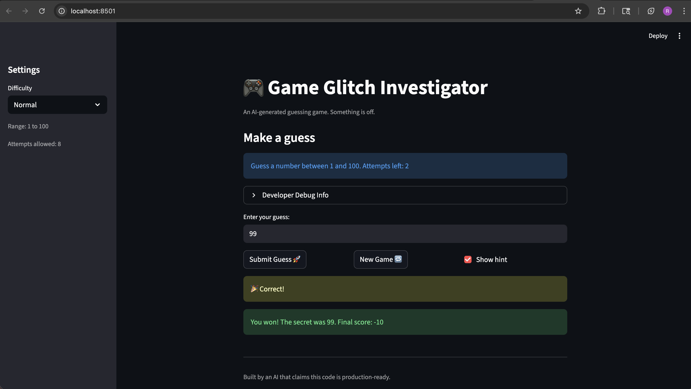
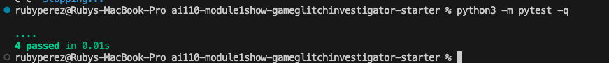

# 🎮 Game Glitch Investigator: The Impossible Guesser

## 🚨 The Situation

You asked an AI to build a simple "Number Guessing Game" using Streamlit.
It wrote the code, ran away, and now the game is unplayable. 

- You can't win.
- The hints lie to you.
- The secret number seems to have commitment issues.

## 🛠️ Setup

1. Install dependencies: `pip install -r requirements.txt`
2. Run the broken app: `python -m streamlit run app.py`

## 🕵️‍♂️ Your Mission

1. **Play the game.** Open the "Developer Debug Info" tab in the app to see the secret number. Try to win.
2. **Find the State Bug.** Why does the secret number change every time you click "Submit"? Ask ChatGPT: *"How do I keep a variable from resetting in Streamlit when I click a button?"*
3. **Fix the Logic.** The hints ("Higher/Lower") are wrong. Fix them.
4. **Refactor & Test.** - Move the logic into `logic_utils.py`.
   - Run `pytest` in your terminal.
   - Keep fixing until all tests pass!

## 📝 Document Your Experience

- The game is a Streamlit number guesser where you try to find a secret number within a limited number of attempts and receive higher/lower hints.
- Bugs found: Normal mode had no winnable answer, Easy mode hints pushed above the described max, New Game could lock input, and Show hint didn’t toggle off.
- Fixes applied: moved core logic into `logic_utils.py`, corrected the hint direction logic, and added targeted pytest coverage for the hint messages.
- If you completed Challenge 1, add a screenshot of your passing pytest run below.

## 📸 Demo

- Screenshot of a winning run:

### ✅ Pytest Results (Challenge 1)

## 🚀 Stretch Features

- [ ] [If you choose to complete Challenge 4, insert a screenshot of your Enhanced Game UI here]
